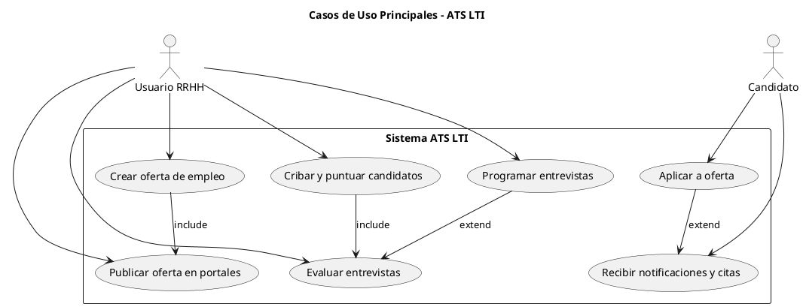

## 🟦 Descripción Breve del Software LTI

**LTI** es un sistema de seguimiento de candidatos (**ATS - Applicant Tracking System**) de nueva generación, diseñado para **agilizar los procesos de selección**, fomentar la **colaboración en tiempo real** entre reclutadores y managers, y potenciar el reclutamiento inteligente gracias a la **integración de inteligencia artificial**.

---

## 💎 Valor Añadido y Ventajas Competitivas

* ✅ **Automatización visual avanzada** de procesos de selección.
* ✅ **Colaboración fluida en tiempo real** entre todos los actores del proceso.
* ✅ **IA aplicada** en cribado, entrevistas y predicción de talento.
* ✅ **Experiencia unificada** para recruiter, manager y candidato.
* ✅ Cumplimiento automático de **GDPR** y trazabilidad de acciones.
* ✅ Dashboards inteligentes adaptados a cada rol.

---

## 🔧 Funciones Principales

* **Publicación inteligente de ofertas** en portales y redes.
* **Cribado automático de CVs** y ranking según perfil ideal.
* **Espacio colaborativo compartido** recruiter-manager con feedback instantáneo.
* **Programación automática de entrevistas** con integración de calendario.
* **Evaluaciones asistidas por IA** en entrevistas y entrevistas automáticas.
* **Workflows personalizables** con automatismos condicionales.
* **CRM de talento** para seguimiento de candidatos pasivos.
* **Reporting avanzado** y alertas sobre bloqueos o retrasos.
* **Módulo de onboarding automatizado** tras contratación.

---

## 🌐 Lean Canvas de LTI

| Elemento                 | Contenido                                                                                                                                        |
| ------------------------ | ------------------------------------------------------------------------------------------------------------------------------------------------ |
| **Problema**             | Procesos largos, poco colaborativos y manuales en la selección. Dificultad para gestionar muchos candidatos y garantizar cumplimiento normativo. |
| **Segmentos de cliente** | Departamentos de RRHH, consultoras de selección, empresas de tecnología y crecimiento rápido.                                                    |
| **Propuesta de valor**   | ATS intuitivo y colaborativo que automatiza el proceso, potencia decisiones con IA y mejora la experiencia del candidato y del equipo.           |
| **Solución**             | Publicación múltiple, cribado automático, IA evaluadora, workflows visuales, dashboards por rol, onboarding automático.                          |
| **Canales**              | Web oficial, partners de software de RRHH, ferias sectoriales, integraciones con ERPs y CRMs.                                                    |
| **Flujos de ingresos**   | Suscripción SaaS mensual/anual por empleado. Planes escalables según tamaño de empresa.                                                          |
| **Estructura de costes** | Desarrollo de software, servidores cloud, soporte, marketing, integraciones, I+D en IA.                                                          |
| **Métricas clau**        | Tiempo medio de contratación, tasa de conversión, tasa de abandono, NPS interno (reclutadores/managers), activación de automatismos.             |
| **Ventaja competitiva**  | IA integrada + interfaz colaborativa + cumplimiento legal automático + onboarding conectado.                                                     |

### 🧩 Diagrama de casos de uso en PlantUML

---

### 📝 Notas de modelado UML:

* `include`: Se usa cuando un caso de uso **siempre implica otro**. Por ejemplo, *crear oferta* siempre lleva a *publicar*.
* `extend`: Se usa cuando un caso de uso **puede opcionalmente derivar en otro**. Por ejemplo, tras *aplicar*, el candidato podría *recibir notificación*, pero no siempre.
* Los actores están bien diferenciados: el **usuario de RRHH** es el que gestiona procesos; el **candidato** interactúa en la parte externa.
* Los casos de uso están enmarcados dentro del sistema **ATS LTI**, siguiendo la convención de encapsular funcionalidades.

---

## 📘 Entidades principales del modelo de datos de LTI

### 1. **OfertaDeEmpleo**

* **Descripción**: Representa una vacante publicada.
* **Campos clave**:

  * `id` (PK)
  * `titulo`
  * `descripcion`
  * `departamento`
  * `ubicacion`
  * `fechaPublicacion`
  * `estado` (activa, cerrada, borrador)
  * `creadaPor` (FK a Usuario)
* **Relaciones**:

  * 1\:N con `Candidatura`
  * N:1 con `Usuario` (recruiter)

---

### 2. **Candidato**

* **Descripción**: Persona que aplica a una o más ofertas.
* **Campos clave**:

  * `id` (PK)
  * `nombre`
  * `email`
  * `telefono`
  * `linkedin`
  * `cvUrl`
  * `fechaRegistro`
* **Relaciones**:

  * 1\:N con `Candidatura`
  * 1\:N con `Entrevista`

---

### 3. **Candidatura**

* **Descripción**: Postulación específica de un candidato a una oferta.
* **Campos clave**:

  * `id` (PK)
  * `idCandidato` (FK)
  * `idOferta` (FK)
  * `fechaAplicacion`
  * `estadoProceso` (nuevo, preseleccionado, entrevista, descartado, contratado)
  * `scoreIA`
  * `feedback`
* **Relaciones**:

  * N:1 con `OfertaDeEmpleo`
  * N:1 con `Candidato`
  * 1\:N con `Entrevista`
  * 1\:N con `Evaluacion`

---

### 4. **Usuario**

* **Descripción**: Persona que usa el sistema (reclutador, manager, HR).
* **Campos clave**:

  * `id` (PK)
  * `nombre`
  * `email`
  * `rol` (Recruiter, Manager, Admin)
  * `departamento`
* **Relaciones**:

  * 1\:N con `OfertaDeEmpleo` (si es creador)
  * 1\:N con `Evaluacion`
  * 1\:N con `Entrevista` (como entrevistador)

---

### 5. **Entrevista**

* **Descripción**: Cita entre candidato y entrevistadores.
* **Campos clave**:

  * `id` (PK)
  * `idCandidatura` (FK)
  * `fecha`
  * `tipo` (presencial, remota)
  * `urlMeet`
  * `entrevistadorId` (FK a Usuario)
* **Relaciones**:

  * N:1 con `Candidatura`
  * N:1 con `Usuario`

---

### 6. **Evaluacion**

* **Descripción**: Resultado y feedback de una entrevista.
* **Campos clave**:

  * `id` (PK)
  * `idCandidatura` (FK)
  * `usuarioId` (FK)
  * `score`
  * `comentarios`
  * `fecha`
* **Relaciones**:

  * N:1 con `Candidatura`
  * N:1 con `Usuario`

---

### 7. **Workflow**

* **Descripción**: Configuración del flujo de etapas para una oferta.
* **Campos clave**:

  * `id` (PK)
  * `nombre`
  * `etapas[]` (array ordenado: CV, Entrevista técnica, Oferta…)
* **Relaciones**:

  * 1\:N con `OfertaDeEmpleo`

---

## 🔗 Relación de entidades (resumen):

* **Usuario** ← crea → **OfertaDeEmpleo**
* **OfertaDeEmpleo** ← tiene → **Candidatura**
* **Candidatura** ← la hace → **Candidato**
* **Candidatura** ← incluye → **Entrevista** y **Evaluacion**
* **Evaluacion** ← la emite → **Usuario**
* **Entrevista** ← la hace → **Usuario**
* **OfertaDeEmpleo** ← usa → **Workflow**

---

